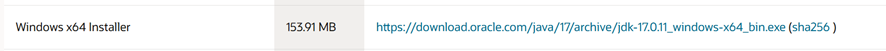
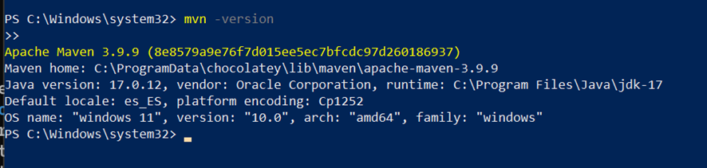
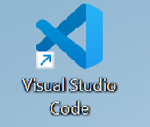
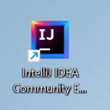

# **Práctica 1: Introducción a Git y GitHub**

Este proyecto corresponde a la Práctica 1 de PAT, donde he aprendido diferentes comandos de git y me he intalado entornos de desarrollo como IntelliJ IDEA y Visual Studio. Esta práctica esta explicada más precisamente en el pdf adjuntado. Aquí daremos una visión general

---

## **Requisitos previos**

1. **JAVA 17**: Descarga e instalación verificadas.
2. **Apache Maven**: Instalado directamente desde PowerShell.
3. **IntelliJ IDEA**: Ya instalado de prácticas previas.
4. **Visual Studio**: Configurado para otros proyectos.

  
  

## **Desarrollo de la práctica**

### **1. Hacer un fork del repositorio original**

Repositorio original: [https://github.com/gitt-3-pat/p1](https://github.com/gitt-3-pat/p1)

Un fork es una copia independiente del repositorio original. Esto nos permite:

- Trabajar en el proyecto sin modificar el original.
- Personalizar y adaptar el proyecto a nuestras necesidades.
- Colaborar en proyectos abiertos.

---

### **2. Clonar el repositorio**

Una vez hecho el fork, cloné el repositorio forkeado en Codespaces.

#### **Comandos a probar:**

##### `git status`
Este comando muestra el estado actual del repositorio. Te permite ver qué archivos han cambiado, cuáles están listos para ser confirmados y cuáles no.

##### `git add .`
Sirve para agregar todos los archivos modificados al área de preparación. Esto prepara los cambios para el próximo commit.

##### `git commit -m "TU MENSAJE"`
Con este comando confirmas los cambios que agregaste al área de preparación. El mensaje entre comillas describe los cambios realizados.

##### `git push`
Este comando sube los commits confirmados en tu repositorio local al repositorio remoto.

##### `git checkout -b feature/1`
Crea una nueva rama llamada `feature/1` y cambia automáticamente a esa rama. Esto se utiliza para trabajar en cambios específicos sin afectar la rama principal.

##### `git checkout main`
Te permite cambiar a la rama principal del proyecto, generalmente llamada `main`. Es útil para regresar a la versión estable del proyecto.
